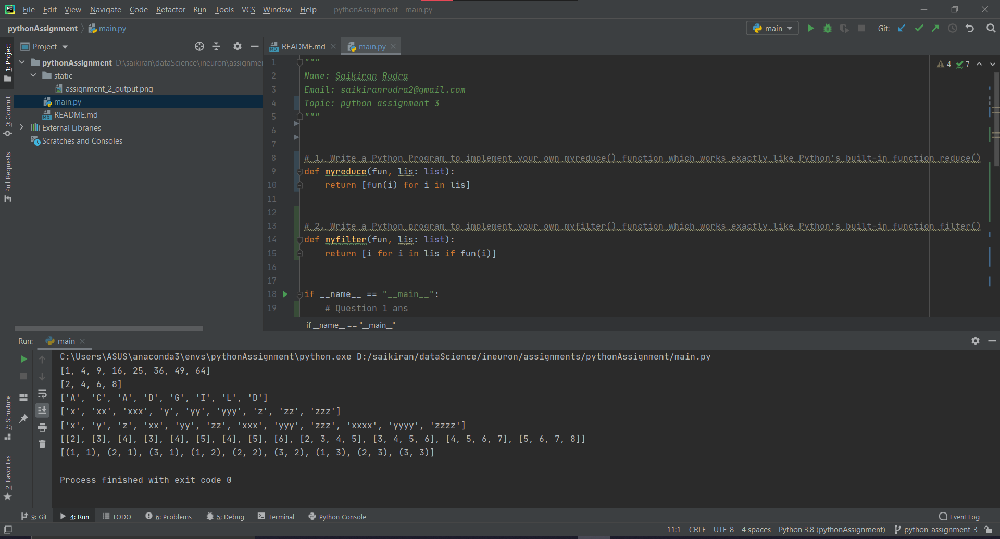

## Assignment 
## Name: python assignment 3

### Questions
1. Write a Python Program to implement your own myreduce() function which works exactly  like Python's built-in function reduce()
2. Write a Python program to implement your own myfilter() function which works exactly  like Python's built-in function filter() 
3. Implement List comprehensions to produce the following lists. Write List comprehensions to produce the following Lists
```terminal
3.1 ['A', 'C', 'A', 'D', 'G', 'I', ’L’, ‘ D’] 
3.2 ['x', 'xx', 'xxx', 'xxxx', 'y', 'yy', 'yyy', 'yyyy', 'z', 'zz', 'zzz', 'zzzz'] 
3.3 ['x', 'y', 'z', 'xx', 'yy', 'zz', 'xxx', 'yyy', 'zzz', 'xxxx', 'yyyy', 'zzzz']
3.4 [[2], [3], [4], [3], [4], [5], [4], [5], [6], [2, 3, 4, 5], [3, 4, 5, 6], [4, 5, 6, 7], [5, 6, 7, 8]]
3.5 [(1, 1), (2, 1), (3, 1), (1, 2), (2, 2), (3, 2), (1, 3), (2, 3), (3, 3)]
```

### Output
