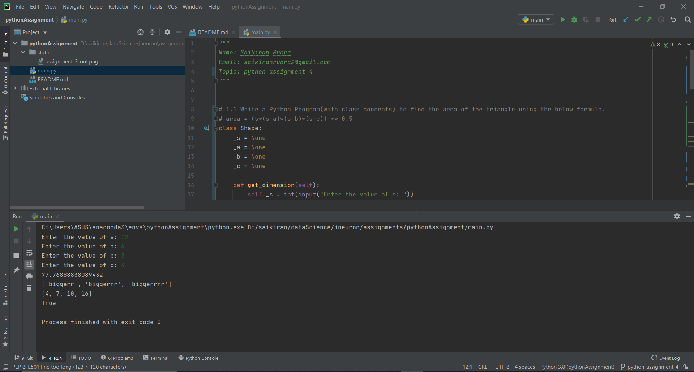

## Assignment 
## Name: python assignment 4

### Questions
1.1 Write a Python Program(with class concepts) to find the area of the triangle using the below formula. area = (s*(s-a)*(s-b)*(s-c)) ** 0.5 

1.2 Write a function filter_long_words() that takes a list of words and an integer n and returns the list of words that are longer than n

2.1  Write a Python program using function concept that maps list of words into a list of integers  representing the lengths of the corresponding words.

Hint: If a list [ ab,cde,erty] is passed on to the python function output should come as [2,3,4] Here 2,3 and 4 are the lengths of the words in the list. Output

2.2 Write a Python function which takes a character (i.e. a string of length 1) and returns True if  it is a vowel, False otherwise.

